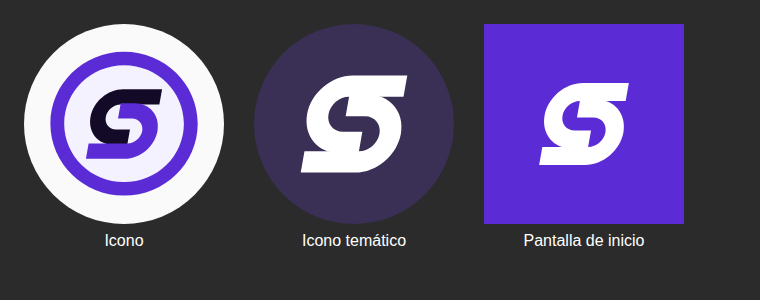

# Surge

Lector de manga, manhwa y webtoon para Android, pensado para que el modo tira larga vaya fluido
en tablets grandes.

## Descargar

Descarga el APK de la [última versión](../../releases/latest):

- `surge-arm64-v8a-vX.Y.Z.apk` para casi todas las tablets y móviles actuales.
- `surge-vX.Y.Z.apk` si el anterior no se instala.

Después, Surge se actualiza desde la propia app: avisa al abrirla cuando hay versión nueva, y también
puedes buscarla en *Más → Acerca de → Buscar actualizaciones*.

## Publicar una versión nueva

1. Sube `versionCode` y `versionName` en `app/build.gradle.kts`.
2. Añade una sección para esa versión en `CHANGELOG.md` (es el texto que la app enseña al actualizar).
3. Haz push a `main`. GitHub Actions compila, firma y publica la release.

Cada push a `main` se compila igualmente, para comprobar que todo sigue funcionando.

## Créditos y licencia

Surge parte del código de [Mihon](https://github.com/mihonapp/mihon), que a su vez continúa
Tachiyomi. Ambos se distribuyen bajo la licencia Apache 2.0, y Surge también: ver [LICENSE](LICENSE).
Algunos nombres internos se mantienen por compatibilidad con las extensiones y los servicios de
seguimiento existentes.
